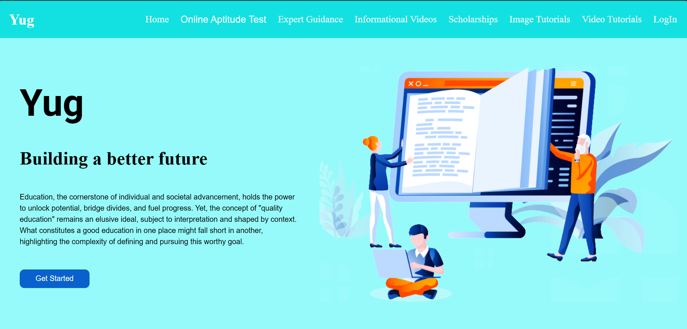
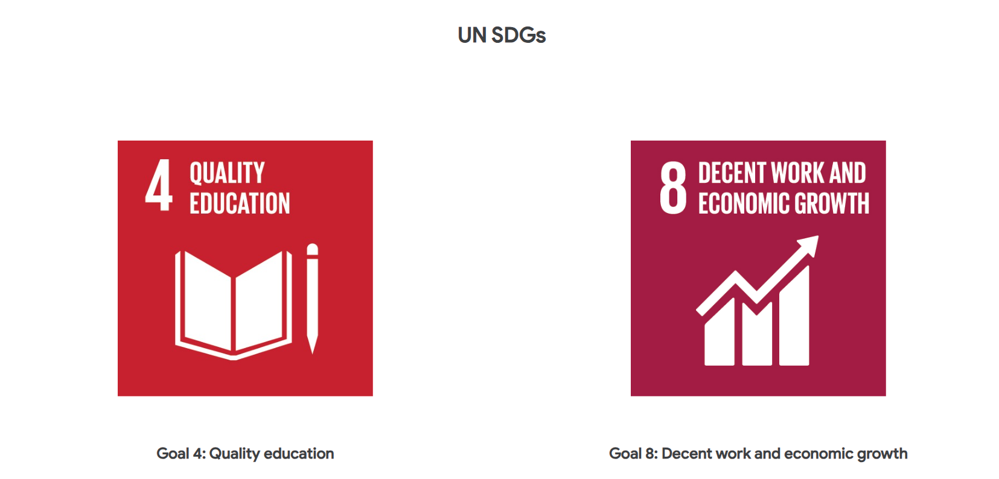

# YUG

## App for Each One Teach One:

YUG conducts after-school tuition for children from weaker sections of the society. These children cannot afford private tutoring. Foundation’s goal is to ensure that financial constraints do not hinder their access to quality education and opportunities for future growth.

To help improve the same, we are creating an app with the following features:-

- Ability to conduct a basic _aptitude test_ to understand the students level of understanding. This will help teachers adjust the curriculum accordingly. The questions are auto created using a sample set.
- _Informational_ videos and _tutorial videos_ for students 1st to 10th grade
- Links to various _scholarship platforms_
- Forum for _career counseling_ and guidance from peers and _experts_
- Support learning through _games_ or story-telling

Education, the cornerstone of individual and societal advancement, holds the power to unlock potential, bridge divides, and fuel progress. Yet, the concept of "quality education" remains an elusive ideal, subject to interpretation and shaped by context. What constitutes a good education in one place might fall short in another, highlighting the complexity of defining and pursuing this worthy goal.

At its core, quality education should nurture the holistic development of every child. It goes beyond rote memorization and standardized tests, encompassing the cultivation of critical thinking, creativity, problem-solving skills, and emotional intelligence. Students should emerge equipped with the ability to learn independently, adapt to change, and contribute meaningfully to the world.

Accessibility and equity are fundamental pillars of quality education. Every child, regardless of background, socioeconomic status, or learning differences, deserves access to quality learning opportunities. This necessitates dismantling systemic barriers, providing adequate resources, and ensuring inclusive learning environments.

Empowered and qualified teachers are the lifeblood of any quality education system. They should be equipped with the knowledge, skills, and support to foster a love of learning in their students. High-quality teacher education, ongoing professional development, and competitive salaries are crucial to attract and retain dedicated educators.

The curriculum itself plays a pivotal role. It should be engaging, relevant, and adaptable to cater to diverse learning styles and needs. Integrating technology, incorporating real-world applications, and encouraging student involvement in the learning process are key ingredients for a stimulating and effective curriculum.

The pursuit of quality education is a continuous journey, demanding ongoing evaluation and adaptation. Regularly assessing learning outcomes, incorporating innovative approaches, and fostering a culture of collaboration are crucial to ensure that education remains relevant and impactful.

We aim to address this issue of providing quality education to the underprivileged section of the society after their school hours. This would not only aim to make them enjoy their *learning process* but would also aim to address the *future job opportunities* that they could avail and improve the *poverty* levels of our country.

### Project SetUp:

Ensure you have the LTS Version of node package manager (*npm*) installed into your system. 
Checkout this article https://docs.npmjs.com/downloading-and-installing-node-js-and-npm if not installed yet.

Use two terminals, one for the client (*frontend*) and another for the server (*backend*).

#### Client Terminal:

> *cd client*

> *npm i*

> *ng serve*

#### Server Terminal:

> *cd server*
 
> *npm i*

> *npm start*

Certain other requirements for running the project are:
 * Google AI studio API key
 * Mongodb atlas URI